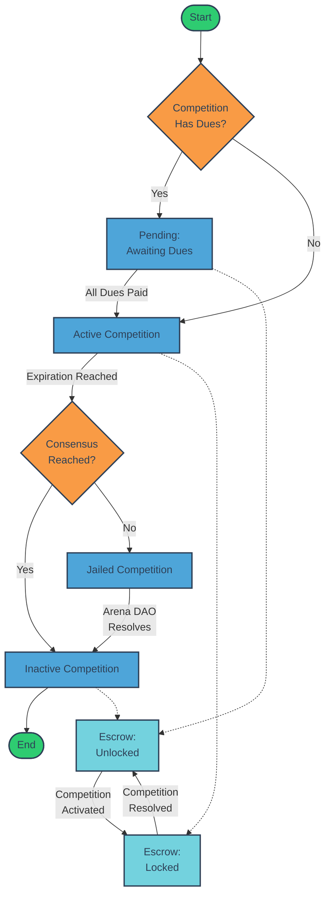

# Arena-Escrow Smart Contract

## Overview

The `arena-escrow` smart contract is designed to manage the lifecycle of competitions and their associated funds. This contract handles dues collection, fund distribution, competition state management, and supports various token types including native, CW20, and CW721 tokens.

## Competition and Escrow Lifecycle

The following flowchart illustrates the lifecycle of a competition and its associated escrow:



## Key Features

- Dues collection and management
- Automatic competition activation
- Fund locking and unlocking
- Distribution of funds based on competition results
- Support for native, CW20, and CW721 tokens
- Layered fee system

## Contract Messages

### InstantiateMsg

```rust
pub struct InstantiateMsg {
    pub dues: Vec<MemberBalanceUnchecked>,
}
```

### ExecuteMsg

The contract supports the following execute messages:

- `Withdraw`: Withdraw funds from the contract
- `Activate`: Activate the competition
- `ReceiveNative`: Receive native tokens
- `Receive`: Receive CW20 tokens
- `ReceiveNft`: Receive CW721 tokens
- `Distribute`: Distribute funds according to the specified distribution and layered fees
- `Lock`: Lock or unlock the contract

Additionally, the contract implements `cw_ownable_execute` for ownership management.

### QueryMsg

The contract supports various query messages:

- `Balances`: Retrieve balances of members
- `Balance`: Get balance of a specific address
- `Due`: Get due amount for a specific address
- `Dues`: List all dues
- `InitialDues`: List initial dues
- `IsFunded`: Check if an address is funded
- `IsFullyFunded`: Check if the contract is fully funded
- `TotalBalance`: Get total balance of the contract
- `IsLocked`: Check if the contract is locked
- `DumpState`: Dump the entire state of the contract

The contract also implements `cw_ownable_query` for ownership-related queries.