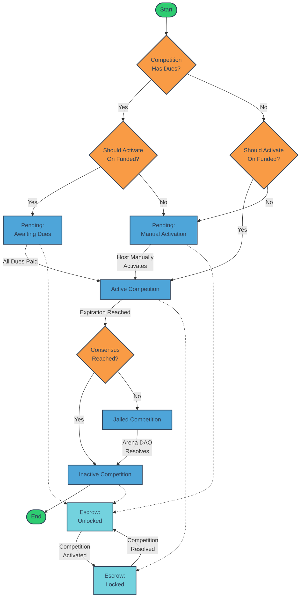

# Arena-Escrow Smart Contract

## Overview

The Arena-Escrow smart contract is a key component of the Arena DAO ecosystem, managing the lifecycle of competitions and their associated funds. This contract handles dues collection, fund distribution, and competition state management.

## Competition and Escrow Lifecycle

The following flowchart illustrates the lifecycle of a competition and its associated escrow:



## Key Features

- Dues collection and management
- Automatic or manual competition activation
- Fund locking and unlocking
- Distribution of funds based on competition results
- Support for native, CW20, and CW721 tokens
- Layered fee system

## Contract Messages

### InstantiateMsg

```rust
pub struct InstantiateMsg {
    pub dues: Vec<MemberBalanceUnchecked>,
    pub should_activate_on_funded: Option<bool>,
}
```

### ExecuteMsg

The contract supports the following execute messages:

- `Withdraw`: Withdraw funds from the contract
- `SetDistribution`: Set the distribution of funds
- `Activate`: Activate the competition
- `ReceiveNative`: Receive native tokens
- `Receive`: Receive CW20 tokens
- `ReceiveNft`: Receive CW721 tokens
- `Distribute`: Distribute funds according to the specified distribution and fees
- `Lock`: Lock or unlock the contract

### QueryMsg

The contract supports various query messages to check balances, dues, funding status, and other state information.
